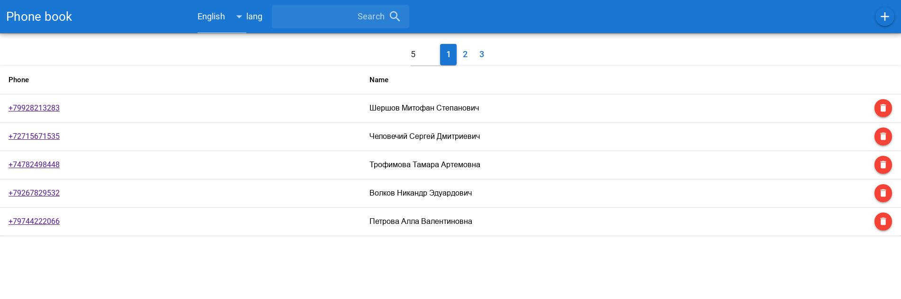
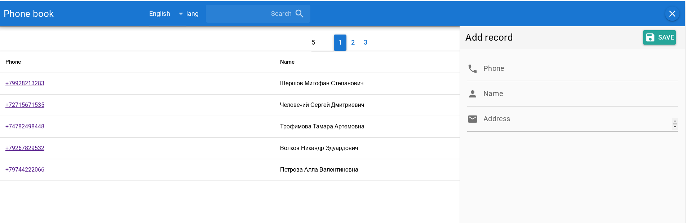
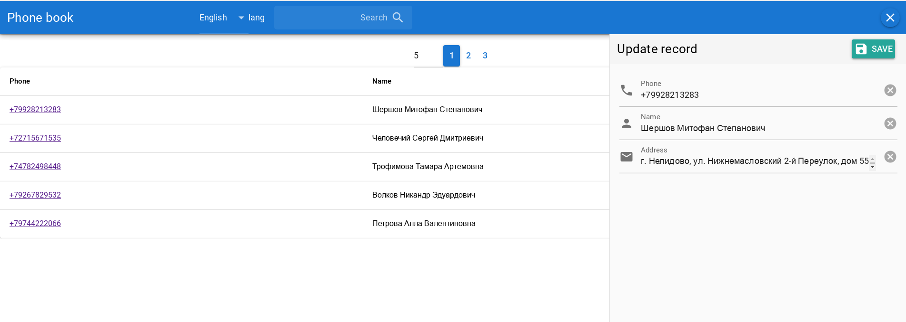
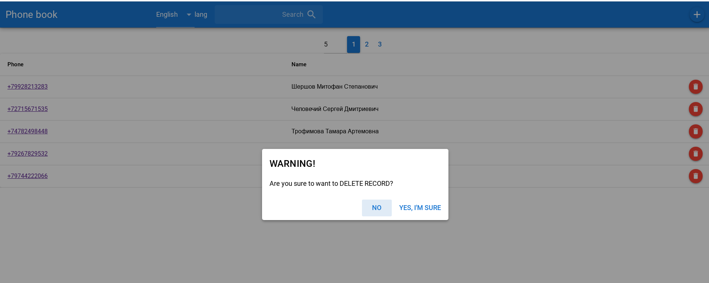
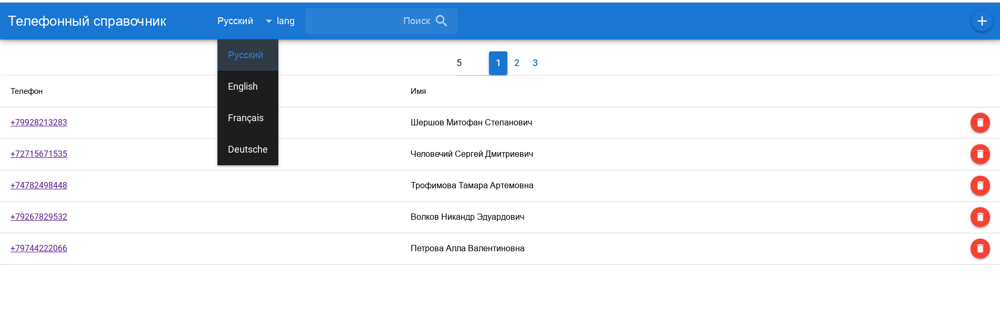

# <a href='https://www.apollographql.com/'></a><a href='https://www.quasar.dev/'></a>

# Quasar CRUD fullstack SPA (phone book)

Sample SPA(Single Page Application) with quasar framework for frontend and Apollo/GraphQL/MongoDB backend

## Clone src on your PC
```bash
git clone https://github.com/alexxsub/quasar-CRUD-fullstack.git
cd quasar-CRUD-fullstack
```
## Install the dependencies
```bash
npm i
```
### Install MongoDB

see manual (https://docs.mongodb.com/manual/installation/)  


### Start backend 
app configured without login and password to MongoDB

```bash
npm run server
```
open url in browser to GraphQL playground [http://localhost:4000/graphql](http://localhost:4000/graphql)

### Start the SPA WEB interface in development mode (hot-code reloading, error reporting, etc.)
```bash
quasar dev
```

### Lint the files
```bash
npm run lint
```

### Build the SPA for production
```bash
quasar build
```

### Start the SPA WEB interface from builded SPA (like production )
```bash
npm run web
```
## Demo
**App supports subscribes from Apollo server**

# Open 2,3,4 ... windows of app.  The results of any CRUD actions in one window will be displayed in anothers. WOW! Amazing? Simple! :)


## Screens of features UI
**Main table of records**
<p float="left">
        <kbd>

                </kbd>
</p>

**Add new record**
<p float="left">
	<kbd>

		</kbd>
</p>

**Update record**
<p float="left">
	<kbd>

		</kbd>
</p>

**Delete record**
<p float="left">
	<kbd>

		</kbd>
</p>

**i18n Internationalization (4 languages:Russian,English,Deutsche,Français)**
<p float="left">
	<kbd>

		</kbd>
</p>


### Quasar Framework
See [Quasar](https://quasar.dev).
